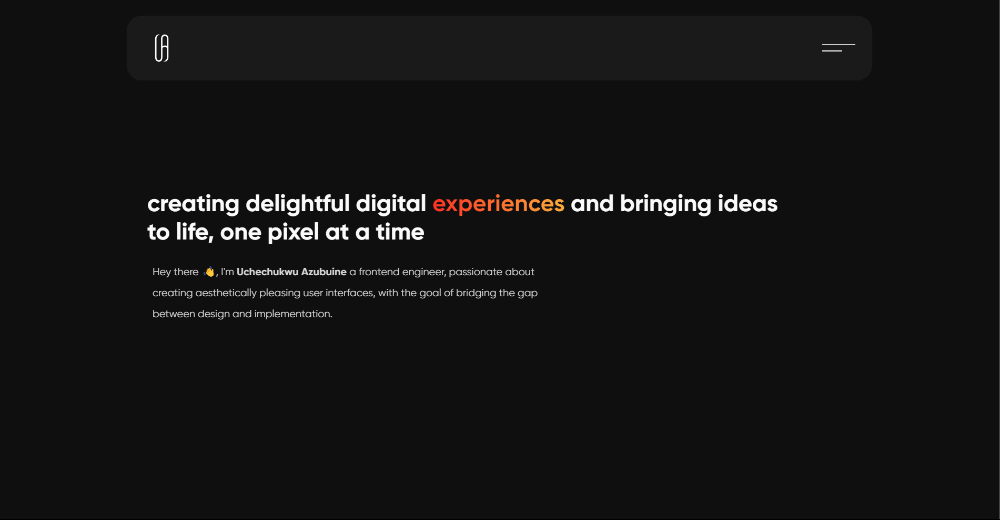

<a href="">
    
</a>

# Portfolio V1

Version one of my personal portfolio
<br/>
[Live Demo]()



**Additional description about the project and its features.**

## Built With

- NextJs
- Chakra UI

## Tools

The following tools help make it easier to run this code.

- [Visual Studio Code](https://code.visualstudio.com/): A source code editor

- [Git](https://git-scm.com/downloads): A tool for managing source code

## Getting Started

### **Prerequisites**

To run this project you need [Node](https://nodejs.org/en/) and [NPM](https://docs.npmjs.com/about-npm-versions) installed on your local machine

```bash
You can use any package manager of your choice, For this project NPM was used
```

### **Setup**

If you have installed git you can clone the code to your machine.

Run the following [git](https://git-scm.com/downloads) command to clone the files to your machine:

```bash
git clone https://github.com/Uchmahn/portfolio.git
```

### **Install**

Once the files are cloned on your machine, open your terminal and `cd to "portfolio" folder` and run the following commands:

**To install all dependencies**

```bash
npm install
```

**To build and configure webpack**

```bash
npm build
```

**To start development server**

```bash
npm dev
```

## Author

- GitHub: [@Uchmahn](https://github.com/Uchmahn)
- Twitter: [@AzubuineU](https://twitter.com/AzubuineU)
- LinkedIn: [Uchechukwu Azubuine](https://linkedin.com/in/uchechukwu-azubuine)

## Show your support

Give a ⭐️ if you like this project!
